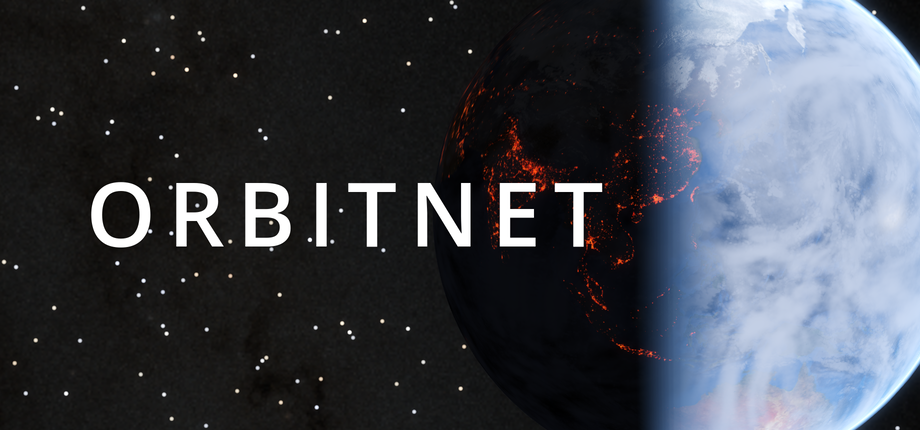
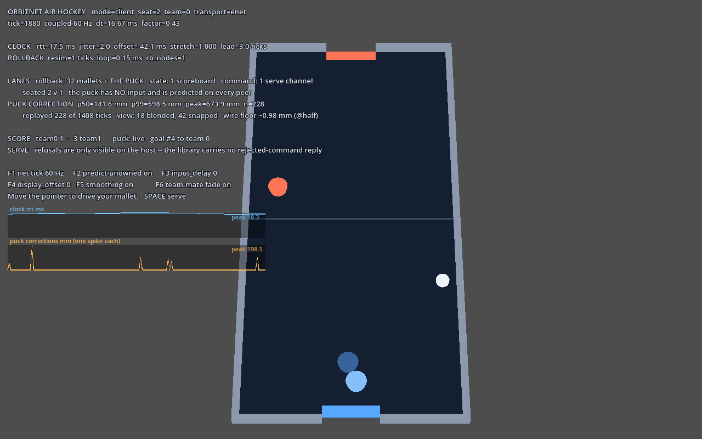

<sub>Godot render. Earth surface from NASA Visible Earth (Blue Marble Next Generation), city lights from NASA
Earth Observatory (Black Marble 2016) and Milky Way from NASA/SVS *Deep Star Maps 2020*. Star positions from the Yale Bright Star Catalog, 5th edition.</sub>

**Rollback netcode for Godot 4, in Rust.** Server-authoritative replication, owner prediction and
reconciliation, batched delta state sync, clock discipline, and interest management — behind one GDScript
facade.

```gdscript
# A replicated, client-predicted player body.
Net.register_rollback_body(
    self, $Input,
    ["position@half", "velocity"],   # state:  server-authored
    ["move", "jump"],                # input:  client-authored, server-validated
    is_multiplayer_authority())
```

```sh
git clone https://github.com/crashtestbrandt/orbitnet && cd orbitnet
just native-install
just rts                         # 96-unit RTS, single player, no networking
just hockey                      # air hockey, a puck every peer predicts
just rts-host                    # then `just rts-join` in another terminal
```

`native-install` builds the extension for this host; a `git clone` carries no binaries.

> **0.x.** `Net` is the surface intended to be stable. The wire format and the Rust internals may change
> between minor versions. Pin a tag.

## Three lanes

Choosing the right one is most of what there is to learn.

| Lane | For | Cost |
|---|---|---|
| **Rollback** — `Net.register_rollback_body()` | an entity whose owner authors continuous per-tick input and predicts locally | a history ring + per-tick compare and replay, per entity |
| **State** — `Net.make_state()` | server-authoritative values pushed every tick, no prediction | one delta block per entity per tick |
| **Command** — `NetCommand` | sparse, discrete, reliable, server-validated requests | one reliable RPC per request |

**The rollback lane restores recorded history onto its properties every tick.** A value written from *outside*
the tick — a command handler, a timer, a signal — is silently overwritten. Those belong on the state lane.
This is the most common OrbitNet bug and it raises no error.

## Install

From a [release](https://github.com/crashtestbrandt/orbitnet/releases), use *AssetLib → Install from file* on
the `orbitnet-*.zip`, then enable **OrbitNet** in *Project → Project Settings → Plugins*. Binaries in the zip
are plain files, not LFS pointers, so they work straight out of it.

To install by hand, copy **both** `addons/orbitnet/` and `addons/orbitnet_native/` from that zip into your
project. Both directories are required: `Net` without the extension is a facade over nothing.

**A `git clone` of this repository carries no binaries** — `addons/orbitnet_native/bin/` is gitignored, and
`just native-install` builds this host's copy. A release also attaches the libraries individually, plus a
`binaries.json` naming the size and sha256 of each, so a project can pin a tag, fetch what its
`.gdextension` names, and verify it.

| | |
|---|---|
| **Godot** | 4.4+ (built against the 4.4 API; loads in anything at or above it) |
| **Language** | GDScript. No C# bindings. |
| **Platforms** | Linux x86_64, Windows x86_64, macOS universal |
| **Transports** | ENet out of the box; Steam via [GodotSteam](https://godotsteam.com/), selected by export-preset feature tag |
| **Not supported** | Web — Godot's web export cannot load a GDExtension |

## Docs

| | |
|---|---|
| [getting-started.md](docs/getting-started.md) | Your first replicated body. **Start here.** |
| [api.md](docs/api.md) | The full surface, wire quantization, and the f64/i64 scalar reality. |
| [rts-demo.md](docs/rts-demo.md) | A worked example that is not a character shooter, with the byte budget spelled out. |
| [hockey-demo.md](docs/hockey-demo.md) | The rollback lane on an object nobody authors, and the correction measured in millimetres. |
| [architecture.md](docs/architecture.md) | Crate layout, batching, history, prop roles, threading. |
| [protocol.md](docs/protocol.md) | Wire format, clock, `is_fresh`, entity lifecycle. |
| [netbench.md](docs/netbench.md) | Impairment relay, bot fleet, tick-domain gates. |
| [building.md](docs/building.md) | Rust toolchain and the binary distribution policy. |
| [steam.md](docs/steam.md) | The Steam transport contract. |
| [CONTRIBUTING.md](CONTRIBUTING.md) | Layout, the enforced boundaries, the GDScript rules. |

## The RTS demo

`demos/rts/` is a two-seat skirmish RTS — 96 units, orders, combat — and it exists to show that **which lane
an entity belongs on is decided by the game**:

- **Rollback: one entity per player**, the command cursor. The only thing an RTS continuously authors, and the
  **AOI anchor** — with no rollback body per peer, `set_aoi_radius()` cannot function at all.
- **State: every unit.** Their input is a sparse order, so there is nothing to predict.
- **Command: every order**, one channel per seat.

Its signature number is **order RTT** — click → validate → adjudicate → *observed* — which is what a player
feels and what ping does not measure. Six keybound levers change it live.

## The air hockey demo



<sub>A **client** at seat 2, with a host and one other client connected, all three driven by bench bots that
chase the puck continuously. `p50=141.6 mm` is how far this peer's predicted puck was from the authoritative
one — roughly the distance the puck travels in one round trip, which is the number a rollback demo exists to
show. Each orange spike is one correction. The two blue mallets at the near end are team 0's; the one behind is
a team-mate, faded because it overlaps.</sub>

`demos/hockey/` is the coupled 60 Hz counterpart — the configuration the RTS demo's `project.godot` names as
unable to coexist with its own — and it exists to show that **the rollback lane is not only for the body you
author**:

- **Rollback: the puck**, registered with an *empty input list* and `predict = true` on every peer. Nobody
  authors it, so every peer simulates it locally and reconciles against the server.
- **Rollback: every mallet**, server-owned state and client-owned input, on a 32-seat static pool with players
  seated on alternating ends as they arrive.
- **State: the scoreboard**, because a goal found inside the tick would be erased by the next rollback restore.
- **Command: `serve`**, one channel, refused while the puck is live.

Its signature number is the **puck correction in millimetres** — the distance between what this peer predicted
for a tick and what the server said about it, reported beside the wire quantization floor that bounds it.

## Limits

Known and filed, not hidden:

- **No per-peer visibility veto.** Interest culling stops an entity's rows; it never withholds the entity, so a
  game needing fog of war can be maphacked.
- **Interest is spatial only, and the anchor is inferred.** A peer's radius is centred on the lowest-id rollback
  entity that peer drives, so a peer driving more than one gets its world centred on whichever that is. There is
  no membership key, so two worlds sharing a coordinate space cannot be told apart.
- **Nothing despawns.** A culled entity freezes at its last received pose rather than leaving the scene.
- **No `NetCommand.rejected` feedback and no `request_batch`.** A refused command is invisible to the client.
- **`@half` silently no-ops on invalid pairings** instead of warning.
- **The retained interest grid is unused.** It reports no leave list, and a leave has to clear the peer's delta
  bookkeeping, so the linear scan is what ships.
- **No reconnection and no packet authentication.** A dropped client loses its entity, and the wire carries
  nothing beyond a per-entity authority check.

## Licence

**MIT OR Apache-2.0**, at your option. See [LICENSE](LICENSE).

The compiled extension links godot-rust (gdext), which is MPL-2.0 — *file-scoped* copyleft, with no gdext file
modified here, so shipping a game with OrbitNet inherits no copyleft obligation. Full reasoning and dependency
inventory: [THIRD_PARTY.md](THIRD_PARTY.md).

Contributions are dual-licensed the same way. Inbound equals outbound; no CLA.
