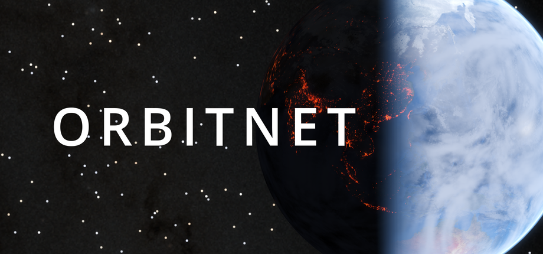
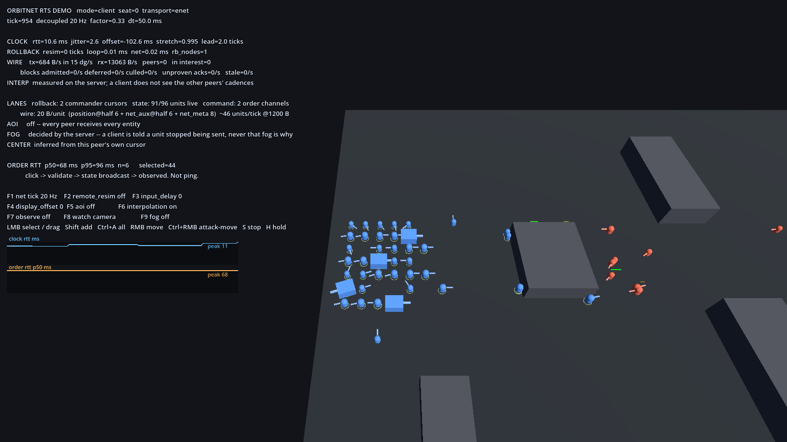
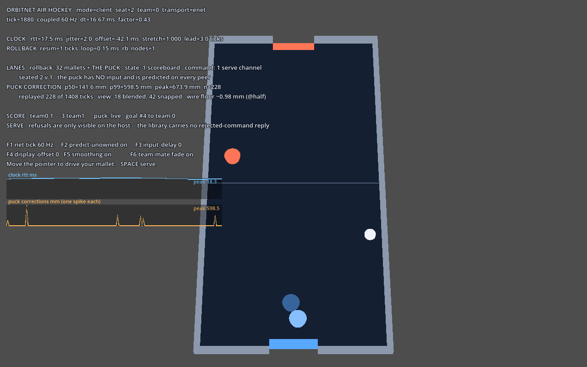
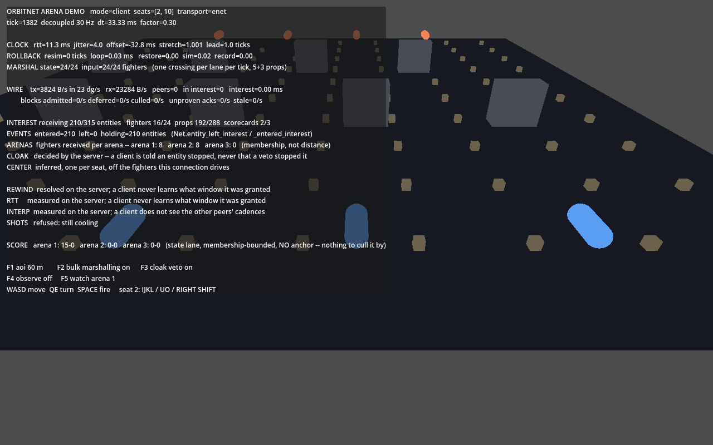

<sub>Godot render. Earth surface from NASA Visible Earth (Blue Marble Next Generation), city lights from NASA
Earth Observatory (Black Marble 2016) and Milky Way from NASA/SVS *Deep Star Maps 2020*. Star positions from the Yale Bright Star Catalog, 5th edition.</sub>

**Rollback netcode for Godot 4, in Rust.** Server-authoritative replication, owner prediction and
reconciliation, batched delta state sync, clock discipline and interest management, behind one GDScript
facade.

```gdscript
# A replicated, client-predicted player body.
Net.register_rollback_body(
    self, $Input,
    ["position@half", "velocity"],   # state:  server-authored
    ["move", "jump"],                # input:  client-authored, server-validated
    is_multiplayer_authority())
```

```sh
git clone https://github.com/crashtestbrandt/orbitnet && cd orbitnet
just native-install              # builds the extension for this host; a clone carries no binaries
just rts                         # 96-unit RTS, single player, no networking
just hockey                      # air hockey, a puck every peer predicts
just rts-host                    # then `just rts-join` in another terminal
```

> **0.x.** `Net` is the surface intended to be stable, and before 1.0 that covers its shape rather than its
> behavior: a minor may change what an existing `Net` call returns. Pin a tag and read
> [CHANGELOG.md](CHANGELOG.md) before moving it. [What 1.0 freezes](docs/protocol.md#what-10-freezes) is the
> policy past 0.x, and [ROADMAP.md](ROADMAP.md) ranks what is open.

## Why OrbitNet

Godot ships `MultiplayerSynchronizer` and `ENetMultiplayerPeer`. OrbitNet is for a game that has outgrown
them: a server that must stay authoritative, players whose own bodies have to feel immediate, and more
entities than one peer should hear about.

| | `MultiplayerSynchronizer` | OrbitNet |
| --- | --- | --- |
| Authority | the node's multiplayer authority, applied as received | the server, for every replicated value |
| A player's own body | owns itself, or waits a round trip for the server | predicted locally, and replayed from a history ring when the server disagrees |
| What crosses the wire | listed properties, per node, on its interval or on change | one batched frame per peer per tick: masked deltas against rows the peer acked, quantized per property |
| Who receives what | a visibility filter per node | interest by distance, by membership and by a per-peer veto, computed per peer per tick |
| Time | none | a disciplined client clock, a measured round trip per peer, and a rewind for lag-compensated hits |
| Rollback bookkeeping | none | the history ring, the per-tick compare, the codec and the interest pass, in Rust |

With raw ENet every row is yours to write and to test.

A correction replays every entity in its window, so a rollback loop's cost is paid once per entity per replayed
tick. Each replayed tick calls the body's `_rollback_tick` in GDScript; the history ring, the compare that
decides a replay, the codec, batching, interest and the clock run in Rust. The demos print the per-tick
figures, and [docs/netbench.md](docs/netbench.md) records them against seeded impairment profiles, so the cost
is measured.

It costs a native extension to download or build, two directories in your project, and three lanes to learn. It
provides no lobby, no matchmaking and no host migration, and it does not run in a web export, which loads no
GDExtension.

## Three lanes

Choosing the right one is most of what there is to learn.

| Lane | For | Cost |
|---|---|---|
| **Rollback**, `Net.register_rollback_body()` | an entity whose owner authors continuous per-tick input and predicts locally | a history ring, and a per-tick compare and replay, per entity |
| **State**, `Net.make_state()` | server-authoritative values pushed when they change, no prediction | one delta block per entity per changed tick, and a keyframe on an interval |
| **Command**, `NetCommand` | sparse, discrete, reliable, server-validated requests | one reliable RPC per request |

**The rollback lane restores recorded history onto its properties every tick.** A value written from outside
the tick, by a command handler, a timer or a signal, is overwritten without an error. Those belong on the
state lane. This is the most common OrbitNet bug.

## Install

From a [release](https://github.com/crashtestbrandt/orbitnet/releases), use *AssetLib → Install from file* on
`orbitnet-<version>.zip`, then enable **OrbitNet** under *Project → Project Settings → Plugins*. To install by
hand, copy both `addons/orbitnet/` and `addons/orbitnet_native/` from that zip. Both are required; the facade
calls into the extension.

A `git clone` carries no binaries. `just native-install` builds this host's copy, and a release attaches every
library with its sha256 in `binaries.json`, so a project can pin a tag and verify what it fetched.

| | |
|---|---|
| **Godot** | 4.4 or later |
| **Language** | GDScript. No C# bindings. |
| **Platforms** | Linux x86_64, Windows x86_64 and macOS universal, each running the unit suites and the extension load smoke in CI. Linux arm64 and Android arm64, arm32 and x86_64 are built and published but have not run on a device. No iOS build; see [docs/building.md](docs/building.md#ios-is-not-a-key-yet). |
| **Transports** | ENet; Steam through [GodotSteam](https://godotsteam.com/), selected by export-preset feature tag |
| **Not supported** | Web |

## Demos



<sub>The RTS demo: a client at seat 0 with a dedicated server and the other seat connected. `ORDER RTT p50=68 ms`
is click to validate to broadcast to observed, measured on the units' own replicated rows.</sub>



<sub>The air hockey demo: a client at seat 2 with a host and one other client. `p50=141.6 mm` is how far this
peer's predicted puck sat from the authoritative one; each orange spike is one correction.</sub>



<sub>The arena demo: a client driving two seats in two arenas. It receives the union of its two worlds, 210 of
the session's 315 entities, and nothing of the third, by membership rather than by distance.</sub>

| Demo | Configuration | What it shows | Its number |
|---|---|---|---|
| `just rts`, `demos/rts/` | decoupled 20 Hz, two seats, 96 units, every unit on the state lane | which lane an entity belongs on is the game's call | order round trip, click to observed |
| `just hockey`, `demos/hockey/` | coupled 60 Hz, 128-tick history, 32 seats | the rollback lane on an object nobody authors | the puck's correction, in millimeters |
| `just arena`, `demos/arena/` | decoupled 30 Hz, 128-tick history, 24 seats, three arenas | who receives what: membership, a per-peer veto, several seats per connection, an observer | the rewind depth per distance band |

Each has a page under [docs/](docs/) with its byte budget and its levers.

## Docs

| | |
|---|---|
| [getting-started.md](docs/getting-started.md) | Your first replicated body. Start here. |
| [api.md](docs/api.md) | The full surface and the wire quantization. |
| [rts-demo.md](docs/rts-demo.md), [hockey-demo.md](docs/hockey-demo.md), [arena-demo.md](docs/arena-demo.md) | The three demos, each with its budget spelled out. |
| [architecture.md](docs/architecture.md) | Crate layout, batching, history, prop roles, threading. |
| [protocol.md](docs/protocol.md) | Wire format, clock, entity lifecycle, the three secret regimes, versioning across releases. |
| [netbench.md](docs/netbench.md) | The impairment relay, the bot fleet, the gates, and runs across machines. |
| [building.md](docs/building.md) | The Rust toolchain and the binary distribution policy. |
| [steam.md](docs/steam.md) | The Steam transport, and what each transport authenticates and encrypts. |
| [crash-capture.md](docs/crash-capture.md) | What a release build records when it dies. |
| [CONTRIBUTING.md](CONTRIBUTING.md) | Layout, the enforced boundaries, the GDScript rules. |
| [CHANGELOG.md](CHANGELOG.md) | Every release, its protocol major, and what an upgrade costs. |
| [ROADMAP.md](ROADMAP.md) | What is open, ranked, with an issue per row. |

## Upgrading

[CHANGELOG.md](CHANGELOG.md) carries every release's upgrade notes, newest first, with the protocol major each
one speaks and what an upgrade from it costs.

- `PROTOCOL_VERSION` is at major 9. Two majors never interoperate: the handshake refuses a mismatch in both
  directions, so every peer in a session upgrades together.
- 0.5.0 changed what `Net.set_session_secret()` does, moved two `NetLagComp` members, and made every
  per-second counter exact; [CHANGELOG.md](CHANGELOG.md#050--2026-10-06) states what to do about each.
- The policy past 0.x is [Versioning across releases](docs/protocol.md#versioning-across-releases).

## License

**MIT OR Apache-2.0**, at your option. See [LICENSE](LICENSE).

The compiled extension links godot-rust (gdext), which is MPL-2.0, file-scoped, with no gdext file modified
here, so a game that ships OrbitNet inherits no copyleft obligation. The reasoning and the dependency
inventory are in [THIRD_PARTY.md](THIRD_PARTY.md).

Contributions are licensed the same way. There is no CLA.
